# roptuna: A Practitioner's Guide to Hyperparameter Optimization

``` r
library(roptuna)
library(ggplot2)
set.seed(42)
```

## Introduction

Every supervised learning model carries hyperparameters — settings fixed
before training begins that the learning algorithm itself cannot
determine. Learning rate, tree depth, regularisation strength, dropout
rate, and kernel bandwidth all fall into this category. Choosing them
well is not optional: a support vector machine with the wrong kernel
width will perform far below its potential on the same data where a
carefully tuned version excels, and the gap widens as the model and
dataset grow.

Manual tuning does not scale. A modern gradient boosting model exposes a
dozen or more hyperparameters; their joint search space is too irregular
for grid search or researcher intuition to navigate efficiently.
**Bayesian optimisation** addresses this by treating hyperparameter
selection as a sequential decision problem: after each trial the
algorithm updates a probabilistic model of the objective surface and
uses it to guide the next sample, concentrating effort in regions likely
to improve on the current best.

`roptuna` is an R implementation of the [Optuna](https://optuna.org/)
framework (Akiba et al. 2019). It brings Optuna’s *define-by-run* API to
native R: instead of declaring the search space as a configuration
object before optimisation begins, you call `trial$suggest_*()` inside
your objective function, and the sampler adapts as evidence accumulates.
This design accommodates **conditional search spaces** — where which
parameters are active depends on the value of a prior parameter —
naturally and without extra machinery.

------------------------------------------------------------------------

## The R HPO Ecosystem

Several packages address hyperparameter optimisation in R, each with
different designs and tradeoffs.

| Package                   | Method              | Interface            | Pruning       | Notes                           |
|---------------------------|---------------------|----------------------|---------------|---------------------------------|
| `roptuna`                 | TPE, Random, Grid   | Define-by-run        | Yes           | This package                    |
| `mlr3tuning`              | Many (via learner)  | mlr3 ecosystem       | Via callbacks | Framework integration           |
| `tune`                    | Many (via engine)   | tidymodels ecosystem | No            | Framework integration           |
| `ParBayesianOptimization` | Gaussian process BO | Formula-based        | No            | GP-based; separate search space |
| `rBayesianOptimization`   | Gaussian process BO | Formula-based        | No            | Simple single-file API          |
| `irace`                   | Iterated racing     | Config-based         | No            | Algorithm configuration focus   |

`roptuna` is a **standalone sampler library**: it does not require mlr3
or tidymodels, but provides adapters for both so it can serve as the
optimisation engine inside either framework. For teams already invested
in those ecosystems the adapters allow `roptuna`’s samplers to be
dropped in without changing workflow, resampling, or preprocessing code.

------------------------------------------------------------------------

## How TPE Works

The default sampler is the **Tree-structured Parzen Estimator** (TPE),
introduced by Bergstra et al. (2011). Understanding what it does
internally helps you use it well and diagnose cases where it
under-performs.

### The core idea

After a configurable number of startup trials (random exploration), TPE
divides past trials into two groups based on their objective value:

- **Good trials** (*l* group): the best γ fraction of completed trials
  (default γ = 0.25)
- **Bad trials** (*g* group): the remaining 1 − γ fraction

For each parameter, TPE fits a **kernel density estimate** over the
parameter values that appeared in each group: $\ell(x)$ over good trials
and $g(x)$ over bad trials. It then generates a set of candidate
parameter values and selects the candidate where the **expected
improvement score** $\ell(x)/g(x)$ is highest.

The intuition is direct: a region where $\ell(x)$ is high and $g(x)$ is
low is a region where good trials concentrate and bad trials do not —
exactly where the next evaluation should land.

### Visualising the mechanism

The scatter plot below shows 20 past trials of a 1-D quadratic
objective. Points are coloured by whether they belong to the good
(bottom 25%) or bad (top 75%) group.

``` r
set.seed(7)
x_obs <- runif(20, -5, 5)
y_obs <- x_obs^2 + rnorm(20, sd = 0.5)

gamma     <- 0.25
threshold <- quantile(y_obs, gamma)
group     <- ifelse(y_obs <= threshold, "Good (bottom 25%)", "Bad (top 75%)")

ggplot(data.frame(x = x_obs, y = y_obs, group = group),
       aes(x = x, y = y, colour = group, shape = group)) +
  geom_point(size = 3.2, alpha = 0.85) +
  geom_hline(yintercept = threshold, linetype = "dashed", colour = "grey45") +
  annotate("text", x = 4.0, y = threshold + 1.4,
           label = sprintf("gamma threshold = %.1f", threshold),
           colour = "grey40", size = 3.2) +
  scale_colour_manual(values = c("Good (bottom 25%)" = "#2171b5",
                                 "Bad (top 75%)"     = "#ef6548")) +
  scale_shape_manual(values  = c("Good (bottom 25%)" = 16,
                                 "Bad (top 75%)"     = 1)) +
  labs(
    title    = "TPE: classifying past trials into 'good' and 'bad'",
    subtitle = "Good trials (bottom 25%) drive the density estimate l(x); bad trials drive g(x)",
    x        = "Parameter value (x)", y = "Objective value f(x)",
    colour   = NULL, shape = NULL
  ) +
  theme_minimal(base_size = 11) +
  theme(legend.position = "bottom",
        plot.title      = element_text(face = "bold"),
        plot.subtitle   = element_text(colour = "grey40"))
```

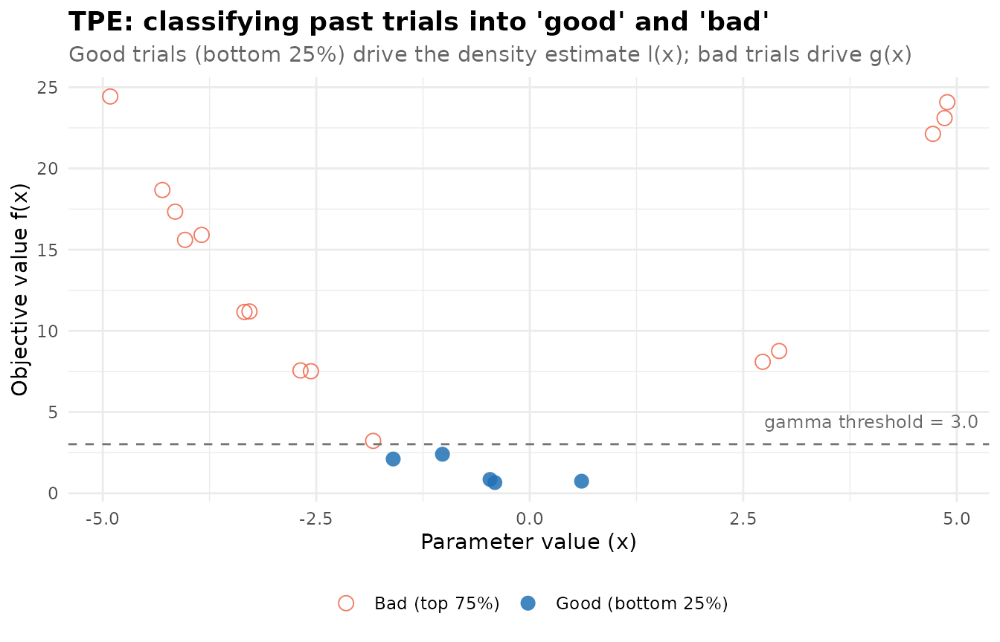

Given these two groups, TPE fits a kernel density estimate for each and
evaluates the acquisition function $\ell(x)/g(x)$ across the domain. The
vertical dotted line marks where this ratio peaks — the suggested
location for the next trial.

``` r
x_good <- x_obs[y_obs <= threshold]
x_bad  <- x_obs[y_obs >  threshold]
x_grid <- seq(-5, 5, length.out = 300)
bw     <- 1.2

l_vals  <- sapply(x_grid, function(xi) mean(dnorm(xi, x_good, bw)))
g_vals  <- sapply(x_grid, function(xi) mean(dnorm(xi, x_bad,  bw)))
ei_vals <- l_vals / (g_vals + 1e-9)

l_norm  <- l_vals  / max(l_vals)
g_norm  <- g_vals  / max(g_vals)
ei_norm <- (ei_vals - min(ei_vals)) / diff(range(ei_vals))
next_x  <- x_grid[which.max(ei_vals)]

df_dens <- rbind(
  data.frame(x = x_grid, y = l_norm,  curve = "l(x) — good trial density"),
  data.frame(x = x_grid, y = g_norm,  curve = "g(x) — bad trial density"),
  data.frame(x = x_grid, y = ei_norm, curve = "EI = l(x)/g(x) — acquisition")
)

ggplot(df_dens, aes(x = x, y = y, colour = curve)) +
  geom_line(linewidth = 0.9) +
  geom_vline(xintercept = next_x, linetype = "dotted",
             linewidth = 1.1, colour = "grey20") +
  annotate("label", x = next_x + 0.3, y = 0.93,
           label = sprintf("Next sample\nx = %.2f", next_x),
           size = 3.1, fill = "white", label.size = 0.3, colour = "grey20") +
  scale_colour_manual(values = c(
    "l(x) — good trial density"     = "#2171b5",
    "g(x) — bad trial density"      = "#ef6548",
    "EI = l(x)/g(x) — acquisition"  = "#238b45"
  )) +
  labs(
    title    = "TPE: density estimates and acquisition function",
    subtitle = "Next trial is placed at the argmax of l(x)/g(x)",
    x        = "Parameter value (x)", y = "Normalised value",
    colour   = NULL
  ) +
  theme_minimal(base_size = 11) +
  theme(legend.position = "bottom",
        plot.title      = element_text(face = "bold"),
        plot.subtitle   = element_text(colour = "grey40"))
```

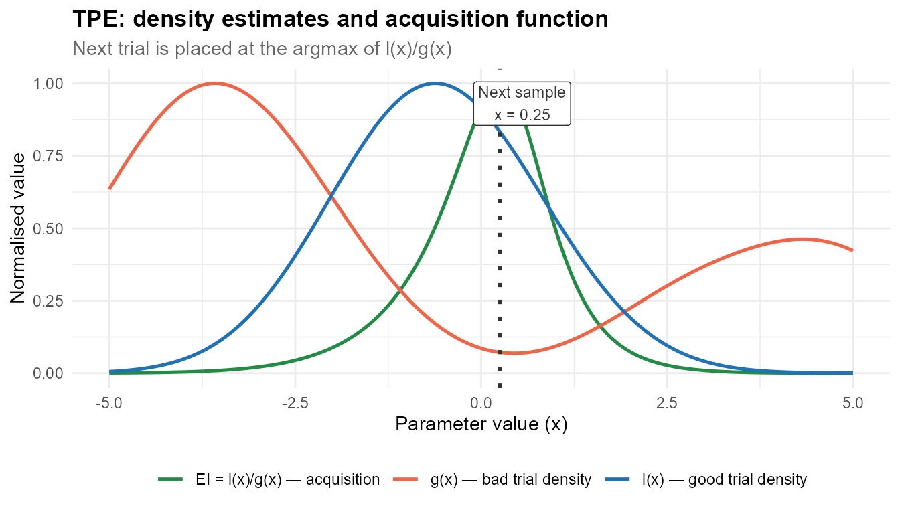

------------------------------------------------------------------------

## Getting Started

### Installation

``` r
# install.packages("remotes")
remotes::install_github("kvenkita/roptuna")
```

### A minimal example

``` r
objective <- function(trial) {
  x <- trial$suggest_float("x", -5, 5)
  y <- trial$suggest_int("y", 1L, 5L)
  x^2 + y
}

study <- create_study("minimize", sampler = tpe_sampler(seed = 42))
study$optimize(objective, n_trials = 50)

cat("Best value:", study$best_value, "\n")
#> Best value: 1.35929
cat("Best params:\n"); str(study$best_params)
#> Best params:
#> List of 2
#>  $ x: num 0.599
#>  $ y: int 1
```

Five functions are all you need for the basic workflow:
[`create_study()`](https://kvenkita.github.io/roptuna/reference/create_study.md),
`study$optimize()`, `trial$suggest_float()`, `trial$suggest_int()`, and
`trial$suggest_categorical()`.

------------------------------------------------------------------------

## The Study–Trial API

### `create_study()`

``` r
study <- create_study(
  direction      = "minimize",    # or "maximize" (single-objective)
  directions     = NULL,          # multi-objective: e.g. c("minimize", "maximize")
  sampler        = tpe_sampler(), # sampling strategy; random_sampler() by default
  pruner         = NULL,          # early stopping (optional)
  storage        = NULL,          # InMemoryStorage by default
  study_name     = "my-study",    # auto-generated if NULL
  load_if_exists = FALSE          # for SQLite: resume an existing study
)
```

### Study active bindings

Once a study has been optimised, the following properties expose
results:

``` r
study_props <- create_study("minimize", sampler = tpe_sampler(seed = 99))
study_props$optimize(function(trial) {
  x <- trial$suggest_float("x", -10, 10)
  x^2
}, n_trials = 30)

cat("Best value:   ", study_props$best_value, "\n")
#> Best value:    0.01316016
cat("Best x:       ", study_props$best_params$x, "\n")
#> Best x:        -0.1147177
cat("Total trials: ", length(study_props$trials), "\n")
#> Total trials:  30
cat("State table:\n"); print(table(sapply(study_props$trials, `[[`, "state")))
#> State table:
#> 
#> complete 
#>       30
```

### `trial$suggest_*()` methods

| Method                                             | Description        | Distribution              |
|----------------------------------------------------|--------------------|---------------------------|
| `trial$suggest_float(name, low, high)`             | Continuous uniform | *U*(low, high)            |
| `trial$suggest_float(name, low, high, log = TRUE)` | Log-uniform        | *LogU*(low, high)         |
| `trial$suggest_int(name, low, high)`               | Discrete uniform   | *DiscreteU*{low, …, high} |
| `trial$suggest_categorical(name, choices)`         | Nominal choice     | Empirical from choices    |

**Parameters are idempotent within a trial.** Calling
`suggest_float("lr", 0, 1)` twice in the same trial always returns the
same value. This is useful when a shared sub-function appears multiple
times in a complex objective.

**Log-scale parameters** should be used whenever a quantity spans more
than one order of magnitude. Learning rates (*10⁻⁵* to *10⁻¹*),
regularisation penalties, and kernel bandwidths are the most common
examples. On a linear scale, TPE’s Parzen estimate concentrates
probability mass at the high end of such a range; log scale distributes
exploration evenly across magnitudes.

``` r
study_demo <- create_study("minimize", sampler = tpe_sampler(seed = 7))
study_demo$optimize(function(trial) {
  lr     <- trial$suggest_float("lr",     1e-5, 1e-1, log = TRUE)
  depth  <- trial$suggest_int("depth",    2L, 8L)
  method <- trial$suggest_categorical("method", c("adam", "sgd", "rmsprop"))
  penalty <- c(adam = 0, sgd = 0.3, rmsprop = 0.6)[[method]]
  (log10(1 / lr) - 3)^2 * 0.1 + 0.05 * depth + penalty
}, n_trials = 40)

cat("Best method:", study_demo$best_params$method, "\n")
#> Best method: adam
cat("Best lr:    ", formatC(study_demo$best_params$lr, format = "e", digits = 2), "\n")
#> Best lr:     9.95e-04
cat("Best depth: ", study_demo$best_params$depth, "\n")
#> Best depth:  2
```

------------------------------------------------------------------------

## Samplers

### Available samplers

| Sampler     | Function                                                      | When to use                                           |
|-------------|---------------------------------------------------------------|-------------------------------------------------------|
| **TPE**     | `tpe_sampler(seed, n_startup_trials, gamma, n_ei_candidates)` | General purpose; default choice                       |
| **Random**  | `random_sampler(seed)`                                        | Baselines; parallel embarrassingly-random search      |
| **Grid**    | `grid_sampler(search_space)`                                  | Exhaustive small grids; all combinations required     |
| **CMA-ES**  | `cmaes_sampler(n_startup_trials, sigma0, seed)`               | Continuous parameters; covariance-guided local search |
| **NSGA-II** | `nsgaii_sampler(population_size, eta_c, eta_m, seed)`         | Multi-objective studies                               |

### TPE vs Random: convergence comparison

The practical advantage of TPE over random search is most visible when
good solutions occupy a small fraction of the search space. The 2-D bowl
below has a clear basin near (0, 0) that TPE locates efficiently while
random search takes longer.

``` r
study_tpe <- create_study("minimize", sampler = tpe_sampler(seed = 123))
study_tpe$optimize(function(trial) {
  x <- trial$suggest_float("x", -10, 10)
  y <- trial$suggest_float("y", -10, 10)
  x^2 + y^2 + 0.5 * x * y    # bowl with a ridge
}, n_trials = 60)

study_rnd <- create_study("minimize", sampler = random_sampler(seed = 456))
study_rnd$optimize(function(trial) {
  x <- trial$suggest_float("x", -10, 10)
  y <- trial$suggest_float("y", -10, 10)
  x^2 + y^2 + 0.5 * x * y
}, n_trials = 60)

extract_history <- function(study, label) {
  vals <- sapply(study$trials, `[[`, "value")
  data.frame(trial = seq_along(vals), value = vals,
             best = cummin(vals), sampler = label)
}

hist_df <- rbind(
  extract_history(study_tpe, "TPE"),
  extract_history(study_rnd, "Random")
)

ggplot(hist_df, aes(x = trial)) +
  geom_point(aes(y = value, colour = sampler), alpha = 0.22, size = 1.3) +
  geom_line(aes(y = best, colour = sampler), linewidth = 1.2) +
  scale_colour_manual(values = c("TPE" = "#2171b5", "Random" = "#ef6548")) +
  labs(
    title    = "TPE vs Random: cumulative best on a 2-D bowl",
    subtitle = "Lines show the running best; points show individual trial objective values",
    x = "Trial number", y = "Objective value", colour = NULL
  ) +
  theme_minimal(base_size = 11) +
  theme(legend.position = "bottom",
        plot.title      = element_text(face = "bold"),
        plot.subtitle   = element_text(colour = "grey40"))
```

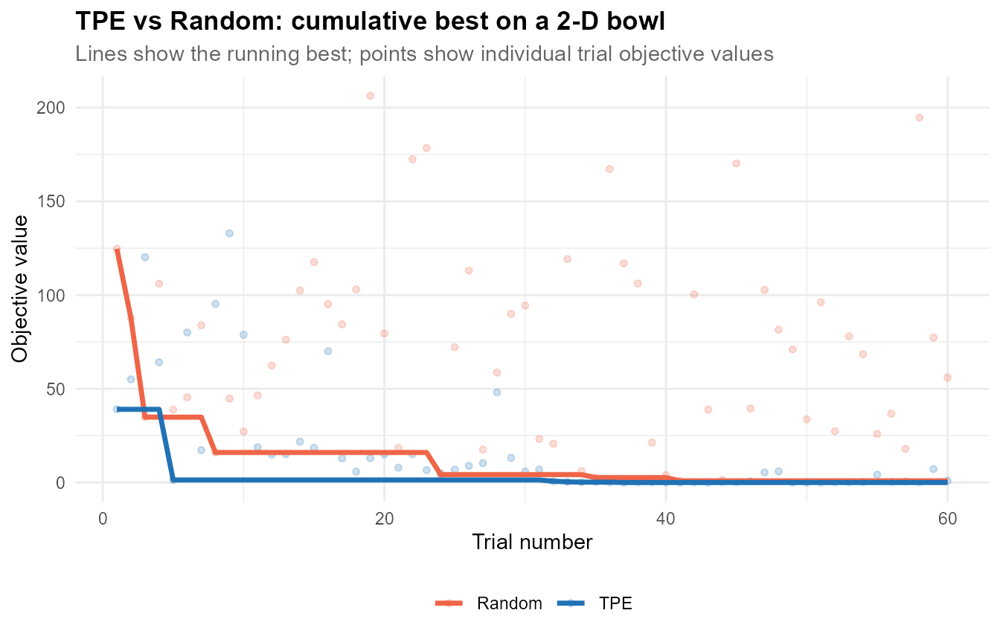

### Grid sampler

The grid sampler exhaustively evaluates every combination of a declared
search space. It is appropriate when the space is small and complete
coverage matters more than sample efficiency — for example, when
ablating a small set of architectural choices.

``` r
study_grid <- create_study("minimize",
  sampler = grid_sampler(list(
    n_estimators = c(50L, 100L, 200L),
    max_depth    = c(3L,  5L,   7L)
  ))
)
study_grid$optimize(function(trial) {
  n <- trial$suggest_categorical("n_estimators", c(50L, 100L, 200L))
  d <- trial$suggest_categorical("max_depth",    c(3L,  5L,  7L))
  0.35 - 0.001 * as.numeric(n) + 0.01 * abs(as.numeric(d) - 4)
}, n_trials = 9)  # 3 × 3 = 9 combinations

grid_df <- do.call(rbind, lapply(study_grid$trials, function(t)
  data.frame(n_estimators = t$params$n_estimators,
             max_depth    = t$params$max_depth,
             value        = round(t$value, 4))))
print(grid_df[order(grid_df$value), ])
#>   n_estimators max_depth value
#> 3          200         3  0.16
#> 6          200         5  0.16
#> 9          200         7  0.18
#> 2          100         3  0.26
#> 5          100         5  0.26
#> 8          100         7  0.28
#> 1           50         3  0.31
#> 4           50         5  0.31
#> 7           50         7  0.33
```

### CMA-ES sampler

The **CMA-ES** (Covariance Matrix Adaptation Evolution Strategy) sampler
fits a multivariate normal distribution over completed trial parameter
vectors and adapts the distribution’s mean, covariance matrix, and step
size every *λ* evaluations. It concentrates search along the principal
axes of the objective landscape, which makes it particularly effective
on **ill-conditioned continuous surfaces** — elongated valleys, ridges,
or objectives where the parameters interact.

CMA-ES applies only to `suggest_float()` parameters. Integer and
categorical parameters fall back to independent sampling via TPE.

``` r
study_cmaes <- create_study("minimize",
  sampler = cmaes_sampler(n_startup_trials = 10L, seed = 42L)
)
study_cmaes$optimize(function(trial) {
  x <- trial$suggest_float("x", -5, 5)
  y <- trial$suggest_float("y", -5, 5)
  # Rosenbrock function: narrow curved valley; notoriously hard for axis-aligned methods
  100 * (y - x^2)^2 + (1 - x)^2
}, n_trials = 100)

cat("Best value:", round(study_cmaes$best_value, 4), "\n")
#> Best value: 0.0566
cat("Best x:    ", round(study_cmaes$best_params$x, 4), "\n")
#> Best x:     0.7696
cat("Best y:    ", round(study_cmaes$best_params$y, 4), "\n")
#> Best y:     0.5863
```

The global minimum of the Rosenbrock function is 0 at (1, 1). CMA-ES
locates it reliably because its covariance adaptation aligns the
sampling ellipsoid with the curved valley, whereas TPE and random search
would require far more trials to probe the narrow optimal region.

------------------------------------------------------------------------

## Pruning

Pruning terminates unpromising trials early, before they consume their
full evaluation budget. A trial whose intermediate performance is
clearly worse than existing trials can be abandoned after a fraction of
its epochs, freeing compute for more promising candidates.

### How to add pruning

Your objective function reports intermediate values with
`trial$report()`, checks `trial$should_prune()`, and signals early
termination with
[`stop_prune()`](https://kvenkita.github.io/roptuna/reference/stop_prune.md).

``` r
study_prune <- create_study(
  "minimize",
  sampler = tpe_sampler(seed = 42),
  pruner  = median_pruner(n_startup_trials = 5L, n_warmup_steps = 3L)
)

study_prune$optimize(function(trial) {
  lr <- trial$suggest_float("lr", 1e-4, 1e-1, log = TRUE)
  for (epoch in seq_len(20)) {
    loss <- exp(-lr * epoch) + 0.1 + rnorm(1, 0, 0.03)
    trial$report(loss, step = as.integer(epoch))
    if (trial$should_prune()) stop_prune()
  }
  loss
}, n_trials = 40)

cat("Trial state distribution:\n")
#> Trial state distribution:
print(table(sapply(study_prune$trials, `[[`, "state")))
#> 
#> complete   pruned 
#>       11       29
```

### Visualising the pruning effect

Training curves for all trials reveal the pruner’s behaviour: trials
with high loss early (low learning rate, slow convergence) are cut
short, while trials that converge quickly (high learning rate) run to
completion.

``` r
traces <- Filter(Negate(is.null), lapply(study_prune$trials, function(t) {
  iv <- t$intermediate_values
  if (length(iv) == 0) return(NULL)
  data.frame(
    trial  = t$number,
    epoch  = as.integer(names(iv)),
    loss   = unlist(iv),
    state  = t$state,
    stringsAsFactors = FALSE
  )
}))
trace_df <- do.call(rbind, traces)
trace_df$label <- ifelse(trace_df$state == "pruned", "Pruned", "Completed")

ggplot(trace_df, aes(x = epoch, y = loss,
                     group = trial, colour = label)) +
  geom_line(alpha = 0.55, linewidth = 0.65) +
  scale_colour_manual(values = c("Pruned" = "#ef6548", "Completed" = "#2171b5")) +
  labs(
    title    = "Trial training curves with MedianPruner",
    subtitle = "Pruned trials (red) are stopped when their loss exceeds the running median",
    x        = "Training epoch", y = "Loss", colour = NULL
  ) +
  theme_minimal(base_size = 11) +
  theme(legend.position = "bottom",
        plot.title      = element_text(face = "bold"),
        plot.subtitle   = element_text(colour = "grey40"))
```

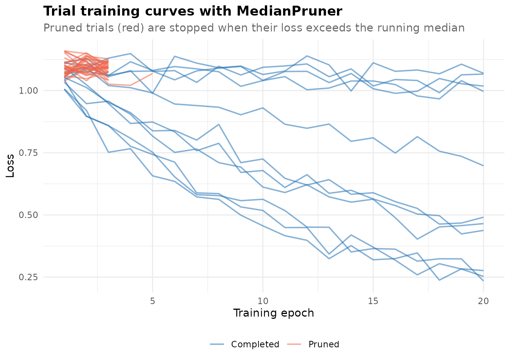

### Pruner reference

| Pruner                        | Function                                                           | Mechanism                                                        |
|-------------------------------|--------------------------------------------------------------------|------------------------------------------------------------------|
| **Median**                    | `median_pruner(n_startup_trials, n_warmup_steps, interval_steps)`  | Prune if loss \> median of completed trials at the same step     |
| **Successive Halving (ASHA)** | `successive_halving_pruner(min_resource, reduction_factor)`        | Promote only the top 1/η fraction to the next resource rung      |
| **Hyperband**                 | `hyperband_pruner(min_resource, reduction_factor, n_brackets)`     | Multi-bracket SHA; robust to budget misspecification             |
| **Wilcoxon**                  | `wilcoxon_pruner(p_threshold, n_startup_trials)`                   | Non-parametric rank test vs completed trials at the same step    |
| **Percentile**                | `percentile_pruner(percentile, n_startup_trials, n_warmup_steps)`  | Prune if loss falls outside the top percentile                   |
| **Threshold**                 | `threshold_pruner(lower, upper, n_startup_trials, n_warmup_steps)` | Prune if loss exceeds a fixed absolute threshold                 |
| **Patient**                   | `patient_pruner(wrapped_pruner, patience, min_delta)`              | Suppress a base pruner until no improvement for `patience` steps |

The MedianPruner is the safer default: it requires relatively few
completed trials before activating and does not depend on a
predetermined total budget. The SuccessiveHalvingPruner is more
aggressive and works best when individual trials are long and you have a
large overall evaluation budget.

### HyperbandPruner

Hyperband (Li et al., 2017) removes the sensitivity of Successive
Halving to the choice of `min_resource` by running **multiple SHA
brackets in parallel**. Each new trial is assigned to a bracket by its
trial index (round-robin), so the brackets operate at different resource
rungs simultaneously without requiring you to pick one configuration
upfront.

``` r
study_hb <- create_study(
  "minimize",
  sampler = tpe_sampler(seed = 42),
  pruner  = hyperband_pruner(
    min_resource            = 1L,
    reduction_factor        = 3L,
    min_early_stopping_rate = 0L,
    n_brackets              = 3L
  )
)
study_hb$optimize(function(trial) {
  lr <- trial$suggest_float("lr", 1e-4, 1e-1, log = TRUE)
  for (epoch in seq_len(27)) {
    loss <- exp(-lr * epoch) + 0.1 + rnorm(1, 0, 0.02)
    trial$report(loss, step = as.integer(epoch))
    if (trial$should_prune()) stop_prune()
  }
  loss
}, n_trials = 40)

cat("State distribution:\n")
#> State distribution:
print(table(sapply(study_hb$trials, `[[`, "state")))
#> 
#> complete   pruned 
#>        3       37
```

### WilcoxonPruner

The WilcoxonPruner applies a one-sided Wilcoxon rank-sum test at each
step, comparing the current trial’s loss against all completed trials at
the same step. The trial is pruned when the p-value falls below
`p_threshold`, indicating with high statistical confidence that the
current trial’s loss distribution is stochastically worse than existing
trials.

This pruner is more principled than a fixed-threshold rule and adapts
automatically to the scale of the objective values.

``` r
study_wx <- create_study(
  "minimize",
  sampler = tpe_sampler(seed = 42),
  pruner  = wilcoxon_pruner(p_threshold = 0.1, n_startup_trials = 5L)
)
study_wx$optimize(function(trial) {
  lr <- trial$suggest_float("lr", 1e-4, 1e-1, log = TRUE)
  for (epoch in seq_len(20)) {
    loss <- exp(-lr * epoch) + 0.1 + rnorm(1, 0, 0.03)
    trial$report(loss, step = as.integer(epoch))
    if (trial$should_prune()) stop_prune()
  }
  loss
}, n_trials = 40)

cat("State distribution:\n")
#> State distribution:
print(table(sapply(study_wx$trials, `[[`, "state")))
#> 
#> complete   pruned 
#>       32        8
```

------------------------------------------------------------------------

## Multi-Objective Optimization

Many real problems require balancing competing objectives simultaneously
— maximising model accuracy while minimising inference latency, or
maximising R² while minimising model complexity. Single-objective
optimisation collapses this trade-off into a scalar, which requires you
to commit to a weighting before the search begins. Multi-objective
optimisation instead explores the full **Pareto front**: the set of
non-dominated solutions where no objective can be improved without
worsening another.

### Creating a multi-objective study

Pass a character vector to `directions=` instead of a single string. Use
[`nsgaii_sampler()`](https://kvenkita.github.io/roptuna/reference/nsgaii_sampler.md),
which maintains population diversity along the front via non-dominated
sorting and crowding distance selection.

``` r
study_mo <- create_study(
  directions = c("minimize", "minimize"),
  sampler    = nsgaii_sampler(population_size = 30L, seed = 5L)
)

study_mo$optimize(function(trial) {
  x <- trial$suggest_float("x", 0, 1)
  y <- trial$suggest_float("y", 0, 1)
  # Objective 1: distance from (0, 0)  — prefers lower-left
  # Objective 2: distance from (1, 1)  — prefers upper-right
  c(x^2 + y^2, (x - 1)^2 + (y - 1)^2)
}, n_trials = 90)

cat("Total trials:          ", study_mo$n_trials, "\n")
#> Total trials:           90
cat("Pareto-optimal trials: ", length(study_mo$best_trials), "\n")
#> Pareto-optimal trials:  27
```

The objective function returns a **numeric vector** — one element per
direction. `study$best_trials` returns the non-dominated subset.

### Inspecting the Pareto front

``` r
pareto <- study_mo$best_trials
pareto_df <- do.call(rbind, lapply(pareto, function(t)
  data.frame(obj1 = t$values[[1]], obj2 = t$values[[2]])
))
pareto_df <- pareto_df[order(pareto_df$obj1), ]
cat("Pareto front (obj1 = dist from (0,0), obj2 = dist from (1,1)):\n")
#> Pareto front (obj1 = dist from (0,0), obj2 = dist from (1,1)):
print(head(round(pareto_df, 3), 8))
#>     obj1  obj2
#> 26 0.047 1.556
#> 4  0.216 1.223
#> 6  0.272 1.209
#> 11 0.274 1.154
#> 3  0.280 1.094
#> 23 0.336 1.068
#> 10 0.352 1.023
#> 16 0.388 0.846
```

### Pareto front plot

``` r
autoplot(study_mo, type = "pareto_front") +
  labs(
    subtitle = "Blue = Pareto-optimal (non-dominated); grey = dominated"
  ) +
  theme_minimal(base_size = 11) +
  theme(plot.title    = element_text(face = "bold"),
        plot.subtitle = element_text(colour = "grey40"))
```

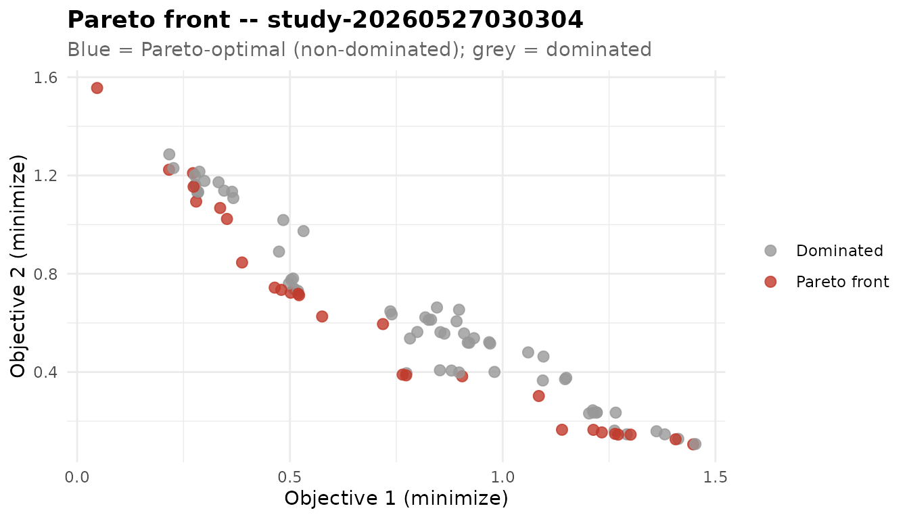

The two objectives cannot both be minimised simultaneously: moving
toward (0, 0) lowers obj1 but raises obj2, and vice versa. The Pareto
front — the curved arc of non-dominated solutions — traces the efficient
trade-off boundary between them.

------------------------------------------------------------------------

## Decoupled Evaluation with ask() / tell()

The standard [`optimize()`](https://rdrr.io/r/stats/optimize.html) loop
samples parameters and evaluates the objective in a single synchronous
cycle. The `ask()` / `tell()` API decouples these two steps, giving you
explicit control over when trials are created and when their results are
recorded. This is useful when:

- Your objective is evaluated by an **external system** (a remote API, a
  subprocess, a hardware device) that operates asynchronously.
- You need to **inspect or transform** the sampled parameters before
  submitting them to the evaluator.
- You want to run **batched external evaluations** and report results in
  bulk.

### Basic usage

``` r
study_at <- create_study("minimize", sampler = tpe_sampler(seed = 42L))

for (i in seq_len(30)) {
  trial <- study_at$ask()                          # create trial, sample params
  x     <- trial$suggest_float("x", -5, 5)         # read sampled parameter
  value <- x^2 + rnorm(1, 0, 0.1)                  # evaluate (could be external)
  study_at$tell(trial, value)                       # record result
}

cat("Best value:", round(study_at$best_value, 4), "\n")
#> Best value: -0.0994
cat("Best x:    ", round(study_at$best_params$x, 4), "\n")
#> Best x:     -0.2143
```

### Batched external evaluation

For systems that accept a batch of inputs and return results
asynchronously, you can keep multiple open trials simultaneously:

``` r
study_batch <- create_study("minimize")

# Sample 4 parameter sets at once
open_trials <- lapply(seq_len(4), function(i) study_batch$ask())
params      <- lapply(open_trials, function(t) t$suggest_float("x", -5, 5))

# ... send params to external evaluator; wait for results ...
values <- lapply(params, function(x) x^2)  # placeholder: local evaluation

# Record results (order does not matter)
for (i in seq_along(open_trials)) {
  study_batch$tell(open_trials[[i]], values[[i]])
}
```

`tell()` accepts an optional `state` argument (`"complete"` by default;
also `"pruned"` or `"failed"`) for cases where the evaluation was cut
short or failed.

------------------------------------------------------------------------

## Parallel Trial Execution

`study$optimize()` accepts an `n_jobs` argument that distributes trial
evaluations across multiple R worker processes using the `parallel`
package. This reduces wall-clock time when each trial takes seconds or
minutes and the machine has multiple cores available.

``` r
study_par <- create_study("minimize", sampler = random_sampler(seed = 1L))
study_par$optimize(
  function(trial) {
    x <- trial$suggest_float("x", -5, 5)
    y <- trial$suggest_float("y", -5, 5)
    x^2 + y^2
  },
  n_trials = 20L,
  n_jobs   = 2L
)
cat("Completed trials:", study_par$n_trials, "\n")
#> Completed trials: 20
cat("Best value:      ", round(study_par$best_value, 4), "\n")
#> Best value:       1.6325
```

### How it works

1.  The **main process** samples parameter values for a batch of
    `n_jobs` trials using the configured sampler.
2.  Parameter sets are serialised and dispatched to **PSOCK worker
    processes** via the `parallel` package.
3.  Workers evaluate the objective function and return objective values.
4.  The main process records all results to storage and repeats until
    `n_trials` are exhausted.

Because all storage writes happen in the main process, parallel
execution is safe with both `InMemoryStorage` and `SqliteStorage`
without any additional configuration.

### When parallel helps

| Scenario                 | Recommendation                                              |
|--------------------------|-------------------------------------------------------------|
| Objective takes \< 0.5 s | `n_jobs = 1` — PSOCK startup cost exceeds savings           |
| Objective takes 1–10 s   | `n_jobs = 2` to `n_jobs = 4` offers meaningful speedup      |
| Objective takes \> 30 s  | Use all available cores: `n_jobs = parallel::detectCores()` |

Note that results will differ from a sequential run with the same seed,
because the order in which parallel trials complete is
non-deterministic.

------------------------------------------------------------------------

## Visualisation

`roptuna` implements `autoplot.Study` with four plot types. All accept
the `Study` object returned by
[`create_study()`](https://kvenkita.github.io/roptuna/reference/create_study.md).

### Setup: a multi-parameter study

``` r
study_viz <- create_study("minimize", sampler = tpe_sampler(seed = 42))
study_viz$optimize(function(trial) {
  lr      <- trial$suggest_float("lr",      1e-4, 1.0, log = TRUE)
  dropout <- trial$suggest_float("dropout", 0.0,  0.8)
  depth   <- trial$suggest_int("depth",     1L,   5L)
  (1 - lr)^2 + 100 * (dropout - lr^2)^2 + 0.5 * depth
}, n_trials = 80)
```

### Optimization history

``` r
autoplot(study_viz, type = "history") +
  theme_minimal(base_size = 11) +
  theme(plot.title = element_text(face = "bold"))
```

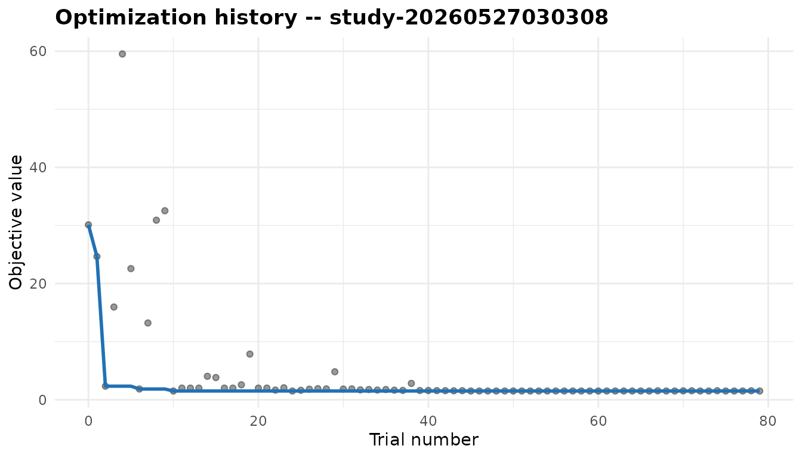

The history plot shows every trial’s objective value (grey points) and
the running best (blue line). The characteristic signature of TPE is a
steep early drop — rapid improvement once the sampler has enough data to
model the surface — followed by a long plateau as the basin has been
well-explored.

### Parallel coordinates

``` r
autoplot(study_viz, type = "parallel_coordinate") +
  theme_minimal(base_size = 11) +
  theme(plot.title = element_text(face = "bold"))
```

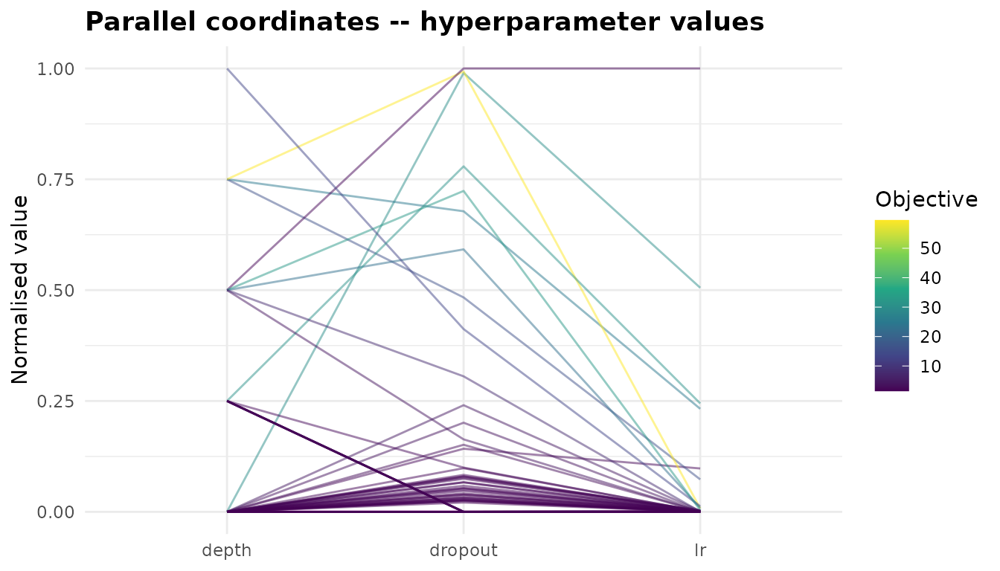

The parallel coordinates plot normalises all hyperparameter values to
\[0, 1\] and draws one line per trial. Lines are coloured by objective
value (darker = lower for minimisation). Regions where many good lines
converge reveal the most promising area of the joint search space and
surface interactions between parameters that a univariate analysis would
miss.

### Parameter importance

``` r
autoplot(study_viz, type = "param_importance") +
  theme_minimal(base_size = 11) +
  theme(plot.title = element_text(face = "bold"))
```

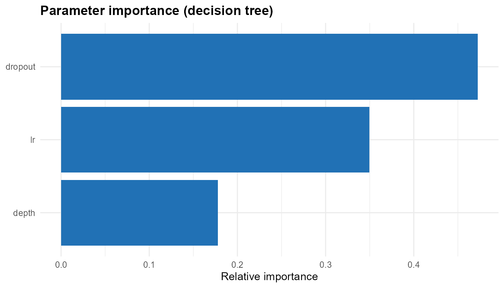

Parameter importance is estimated by fitting a shallow decision tree
(`rpart`) to the completed trials and reporting the variable importance
scores. Parameters with near-zero importance can often be fixed at their
default values in subsequent rounds, effectively reducing the search
space and making each remaining trial more informative.

### Pareto front (multi-objective)

For multi-objective studies, `type = "pareto_front"` plots all trials in
objective-value space, colouring Pareto-optimal trials in blue and
dominated trials in grey. See the [Multi-Objective
Optimization](#multi-objective-optimization) section for a worked
example.

``` r
autoplot(study_mo, type = "pareto_front")
```

------------------------------------------------------------------------

## Persistent Studies

`roptuna` offers two persistence backends. By default, trial results are
stored in memory and are lost when the R session ends.

### SQLite storage

SQLite persistence provides a durable, queryable record that survives
session restarts and can be shared across machines.

``` r
tmp_db <- tempfile(fileext = ".sqlite")

# First session: run 20 trials
study_s1 <- create_study(
  "minimize",
  sampler    = tpe_sampler(seed = 11),
  storage    = sqlite_storage(tmp_db),
  study_name = "persistent-demo"
)
study_s1$optimize(function(trial) trial$suggest_float("x", -5, 5)^2,
                  n_trials = 20)
cat("Session 1 best:", round(study_s1$best_value, 5), "\n")
#> Session 1 best: 0.01125

# Second session: reload and add 20 more trials
study_s2 <- create_study(
  "minimize",
  sampler        = tpe_sampler(seed = 22),
  storage        = sqlite_storage(tmp_db),
  study_name     = "persistent-demo",
  load_if_exists = TRUE
)
study_s2$optimize(function(trial) trial$suggest_float("x", -5, 5)^2,
                  n_trials = 20)
cat("Session 2 total trials:", length(study_s2$trials), "\n")
#> Session 2 total trials: 40
cat("Overall best:          ", round(study_s2$best_value, 6), "\n")
#> Overall best:           0.00037

unlink(tmp_db)
```

The `load_if_exists = TRUE` flag finds an existing study by name in the
database rather than creating a fresh one. All prior trials are
immediately available through `study$trials`, and the new sampler uses
them to inform its subsequent suggestions — the optimisation continues
where the previous session left off.

### Journal storage

[`journal_storage()`](https://kvenkita.github.io/roptuna/reference/journal_storage.md)
is a lightweight alternative that appends each operation to a
newline-delimited JSON file (`.jsonl`). It requires no database engine
and produces a human-readable log that can be inspected with any text
editor. On startup, `roptuna` replays the log to reconstruct the study
state in memory.

``` r
tmp_jl <- tempfile(fileext = ".jsonl")

# First session: run 20 trials
study_j1 <- create_study(
  "minimize",
  sampler    = tpe_sampler(seed = 11),
  storage    = journal_storage(tmp_jl),
  study_name = "journal-demo"
)
study_j1$optimize(function(trial) trial$suggest_float("x", -5, 5)^2,
                  n_trials = 20)
cat("Session 1 best:", round(study_j1$best_value, 5), "\n")
#> Session 1 best: 0.01125

# Second session: reload by replaying the log
study_j2 <- create_study(
  "minimize",
  sampler        = tpe_sampler(seed = 22),
  storage        = journal_storage(tmp_jl),
  study_name     = "journal-demo",
  load_if_exists = TRUE
)
study_j2$optimize(function(trial) trial$suggest_float("x", -5, 5)^2,
                  n_trials = 20)
cat("Session 2 total trials:", length(study_j2$trials), "\n")
#> Session 2 total trials: 40
cat("Overall best:          ", round(study_j2$best_value, 6), "\n")
#> Overall best:           0.00037

unlink(tmp_jl)
```

| Backend      | Function                | Best for                                                     |
|--------------|-------------------------|--------------------------------------------------------------|
| **InMemory** | *(default)*             | Single-session experiments; fastest                          |
| **SQLite**   | `sqlite_storage(path)`  | Multi-session; resumable; full SQL query access              |
| **Journal**  | `journal_storage(path)` | Lightweight persistence; human-readable log; no SQL required |

------------------------------------------------------------------------

## A Realistic Example: Tuning a Decision Tree on Iris

This section demonstrates a complete HPO workflow on a real dataset: a
three-hyperparameter search including a log-scale parameter, 5-fold
cross-validation as the objective, and all three plot types applied to
the results.

``` r
set.seed(42)

iris_objective <- function(trial) {
  minsplit <- trial$suggest_int("minsplit", 2L, 40L)
  maxdepth <- trial$suggest_int("maxdepth", 1L, 12L)
  cp       <- trial$suggest_float("cp", 0.0001, 0.5, log = TRUE)

  folds <- sample(rep(1:5, length.out = nrow(iris)))
  acc <- vapply(1:5, function(k) {
    tr  <- iris[folds != k, ]
    te  <- iris[folds == k, ]
    fit <- rpart::rpart(
      Species ~ ., data = tr, method = "class",
      control = rpart::rpart.control(
        minsplit = minsplit, maxdepth = maxdepth, cp = cp
      )
    )
    mean(predict(fit, te, type = "class") == te$Species)
  }, numeric(1))
  1 - mean(acc)
}

study_iris <- create_study("minimize", sampler = tpe_sampler(seed = 42))
study_iris$optimize(iris_objective, n_trials = 60)

cat("Best CV error rate:", round(study_iris$best_value, 4), "\n")
#> Best CV error rate: 0.04
cat("Best params:\n"); str(study_iris$best_params)
#> Best params:
#> List of 3
#>  $ minsplit: int 8
#>  $ maxdepth: int 5
#>  $ cp      : num 0.00254
```

``` r
autoplot(study_iris, type = "history") +
  labs(subtitle = "iris CART: 5-fold CV error over 60 trials") +
  theme_minimal(base_size = 11) +
  theme(plot.title    = element_text(face = "bold"),
        plot.subtitle = element_text(colour = "grey40"))
```

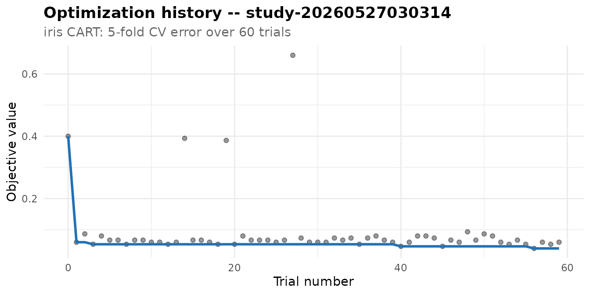

``` r
autoplot(study_iris, type = "parallel_coordinate") +
  theme_minimal(base_size = 11) +
  theme(plot.title = element_text(face = "bold"))
```

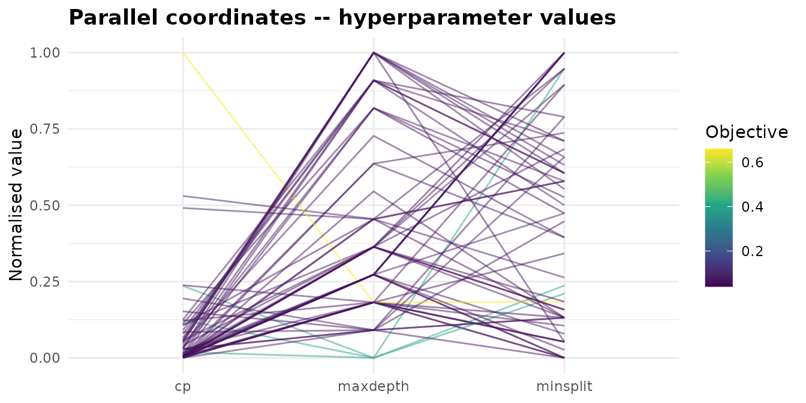

``` r
autoplot(study_iris, type = "param_importance") +
  theme_minimal(base_size = 11) +
  theme(plot.title = element_text(face = "bold"))
```

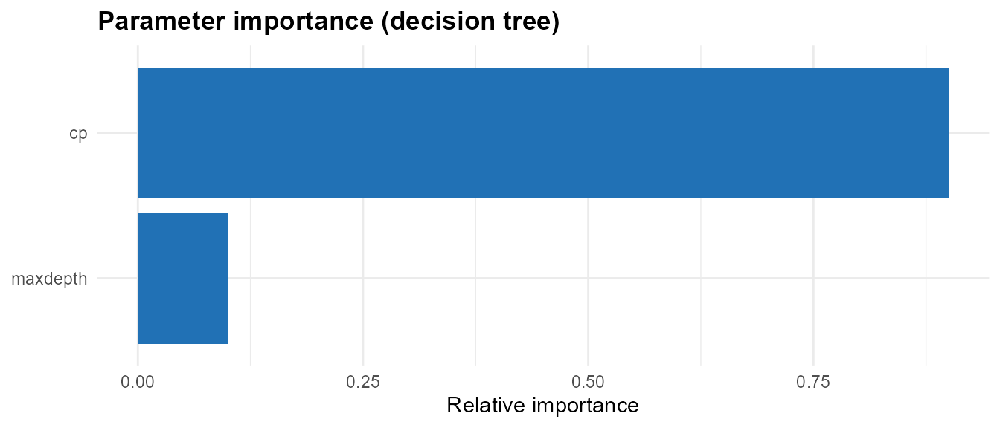

The importance plot reveals which of the three hyperparameters most
influences cross-validated accuracy. On iris, `cp` (the complexity
parameter that sets the minimum improvement required for a split)
typically dominates — the tree structure is more sensitive to
over-splitting than to maximum depth alone, because iris is nearly
linearly separable and shallow trees suffice.

------------------------------------------------------------------------

## Framework Adapters

`roptuna` provides adapters for the two major R modelling frameworks.
These are thin wrappers that plug `roptuna`’s samplers into the
framework’s existing workflow, resampling, and metric infrastructure.

### tidymodels

``` r
library(tune); library(parsnip); library(rsample); library(workflows)

dt_spec <- decision_tree(
  min_n = tune(), tree_depth = tune(), cost_complexity = tune()
) |>
  set_engine("rpart") |>
  set_mode("classification")

wf  <- workflow() |> add_model(dt_spec) |> add_formula(Species ~ .)
cv  <- vfold_cv(iris, v = 5)

res <- tune_optuna(wf, cv,
  direction = "minimize",
  metric    = "accuracy",
  n_trials  = 40,
  sampler   = tpe_sampler(seed = 1L)
)
tune::show_best(res)
```

### mlr3

``` r
library(mlr3); library(mlr3tuning); library(paradox)

task    <- tsk("iris")
learner <- lrn("classif.rpart",
               minsplit = to_tune(2L, 40L),
               maxdepth = to_tune(1L, 12L))
tuner   <- TunerOptuna$new(direction = "minimize",
                            sampler   = tpe_sampler(seed = 1L))
ti <- tune(
  tuner      = tuner,
  task       = task,
  learner    = learner,
  resampling = rsmp("cv", folds = 5L),
  measures   = msr("classif.ce"),
  term_evals = 40L
)
ti$result
```

------------------------------------------------------------------------

## Practical Guidance

### How many trials?

Allow roughly **10–20 trials per active hyperparameter** for TPE to move
past its startup phase and build a meaningful surface model. For three
hyperparameters, 50–100 trials is a reasonable starting budget. If the
objective is cheap (under a second per trial), run 200 or more; the
improvement in sample efficiency compounds. For expensive objectives
(minutes per trial), consider starting with random search to build a
baseline, then switching to TPE.

### Choosing n_startup_trials

The `n_startup_trials` argument (default 10) controls how many random
trials are run before TPE activates. Increasing it reduces the risk of
overfitting to an unlucky initial sample; decreasing it starts Bayesian
exploitation earlier but on thinner evidence. For fewer than 3 active
parameters, `n_startup_trials = 5` is usually sufficient. For 10 or more
parameters, consider `n_startup_trials = 20`.

### Conditional search spaces

`roptuna`’s define-by-run design handles conditional parameters
naturally — only call `suggest_*()` for parameters that are active given
earlier choices.

``` r
study_cond <- create_study("minimize", sampler = tpe_sampler(seed = 42))
study_cond$optimize(function(trial) {
  model <- trial$suggest_categorical("model", c("linear", "tree"))
  if (model == "linear") {
    alpha <- trial$suggest_float("alpha", 0.0001, 10, log = TRUE)
    0.5 + log10(alpha + 1) * 0.08
  } else {
    depth <- trial$suggest_int("depth", 1L, 8L)
    0.3 + 0.05 * depth
  }
}, n_trials = 40)

cat("Best model:", study_cond$best_params$model, "\n")
#> Best model: tree
if (study_cond$best_params$model == "tree") {
  cat("Best depth:", study_cond$best_params$depth, "\n")
} else {
  cat("Best alpha:", round(study_cond$best_params$alpha, 4), "\n")
}
#> Best depth: 1
```

Parameters that were never suggested in the best trial simply do not
appear in `best_params`. This is the expected behaviour for conditional
spaces and requires no special handling.

### Handling objective failures

If the objective occasionally fails — NaN loss, numerical overflow, an
out-of-memory error on an extreme hyperparameter combination — use the
`catch` argument to absorb specific error classes rather than aborting
the study:

``` r
study_robust <- create_study("minimize")
study_robust$optimize(
  function(trial) {
    x <- trial$suggest_float("x", -5, 5)
    if (x > 4.2) stop("simulated domain error")
    x^2
  },
  n_trials = 25,
  catch    = "simpleError"
)
cat("State distribution:\n")
#> State distribution:
print(table(sapply(study_robust$trials, `[[`, "state")))
#> 
#> complete   failed 
#>       22        3
```

Failed trials are stored with state `"failed"` and excluded from TPE’s
model. The study continues without interruption, and the failed trial
count gives you a signal that the extreme region of the search space is
problematic.

### Using a timeout

For production HPO where wall-clock time matters more than a fixed trial
count, use `timeout` (seconds) instead of or in addition to `n_trials`:

``` r
study$optimize(objective, n_trials = 1000L, timeout = 3600)  # stop after 1 hour
```

The loop stops at the end of the first trial that completes after the
timeout — no trial is interrupted mid-evaluation.

------------------------------------------------------------------------

## Citation

If you use `roptuna` in published research, please cite both the package
and the Optuna paper:

``` bibtex
@software{Venkitasubramanian2026roptuna,
  author = {Venkitasubramanian, Kailas},
  title  = {{roptuna}: Hyperparameter Optimization Using the {Optuna} Framework},
  year   = {2026},
  url    = {https://github.com/kvenkita/roptuna},
  note   = {R package version 0.1.0}
}

@inproceedings{Akiba2019optuna,
  author    = {Akiba, Takuya and Sano, Shotaro and Yanase, Toshihiko and
               Ohta, Takeru and Koyama, Masanori},
  title     = {Optuna: A Next-generation Hyperparameter Optimization Framework},
  booktitle = {Proceedings of the 25th {ACM} {SIGKDD} International Conference
               on Knowledge Discovery and Data Mining},
  year      = {2019},
  doi       = {10.1145/3292500.3330701}
}
```

``` r
citation("roptuna")
```

**Contact and feedback:** Bug reports and feature requests are welcome
at <kailasv@gmail.com> or via the [GitHub issue
tracker](https://github.com/kvenkita/roptuna/issues).

**Copyright © 2026 Kailas Venkitasubramanian.** Released under the MIT
License.

------------------------------------------------------------------------

## References

Akiba, T., Sano, S., Yanase, T., Ohta, T., and Koyama, M. (2019).
Optuna: A next-generation hyperparameter optimization framework.
*Proceedings of the 25th ACM SIGKDD International Conference on
Knowledge Discovery and Data Mining*, 2623–2631.
<DOI:10.1145/3292500.3330701>.

Bergstra, J., Bardenet, R., Bengio, Y., and Kégl, B. (2011). Algorithms
for hyper-parameter optimization. *Advances in Neural Information
Processing Systems* 24 (NIPS 2011).
<https://proceedings.neurips.cc/paper_files/paper/2011/hash/86e8f7ab32cfd12577bc2619bc635690-Abstract.html>.

Falkner, S., Klein, A., and Hutter, F. (2018). BOHB: Robust and
efficient hyperparameter optimization at scale. *Proceedings of the 35th
International Conference on Machine Learning (ICML 2018)*, PMLR
80:1437–1446.

Li, L., Jamieson, K., DeSalvo, G., Rostamizadeh, A., and Talwalkar, A.
(2017). Hyperband: A novel bandit-based approach to hyperparameter
optimization. *Journal of Machine Learning Research*, 18(1), 6765–6816.
